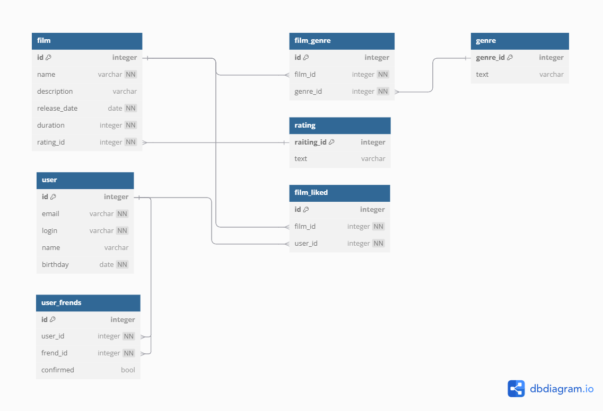

# java-filmorate
## Приложение представляет собой сервис, который работает с фильмами и оценками пользователей.

### Схема БД:


### Примеры запросов:
```SQL
SELECT * 
FROM film;
```
```SQL
SELECT * 
FROM user;
```
```SQL
SELECT u1.name,
       u2.name
FROM from user_frends;
```
```SQL
SELECT us.name  AS user_name,
       fr.name AS frend_name 
FROM user_frends AS uf 
INNER JOIN user AS us ON uf.user_id = us.id
INNER JOIN user AS fr ON uf.frend_id = fr.id;
```

